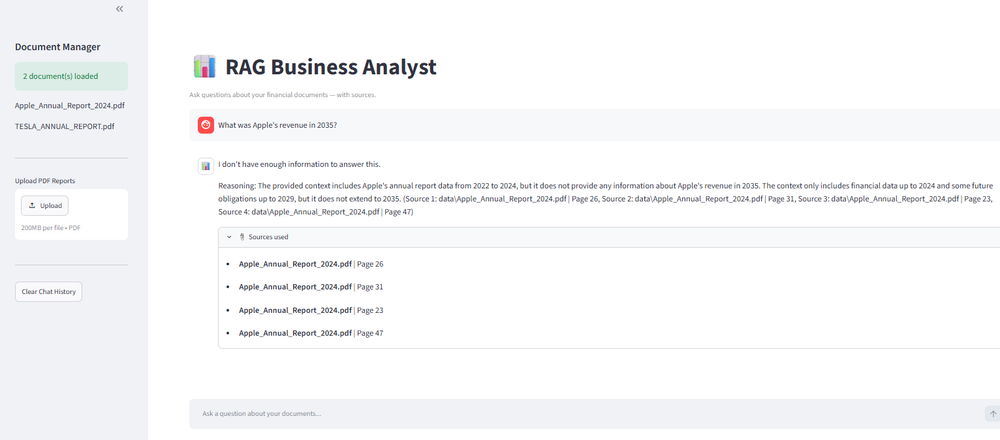

# 📊 RAG Business Analyst


A production-style Retrieval-Augmented Generation (RAG) system that ingests company financial reports (PDFs), retrieves the most relevant context using semantic search, and answers business questions with cited sources and step-by-step reasoning.

---

##  Demo

Ask questions like:
- *"What was Apple's total revenue in 2024?"*
- *"Compare Tesla and Apple's net income in 2024"*
- *"What are the main risk factors mentioned in Tesla's annual report?"*
- *"Which company had better profit margins in 2024?"*

The system retrieves the exact pages, cites sources, and explains its reasoning — without hallucinating.

---



## Architecture

```
PDF Documents
     ↓
[PyPDFLoader] → Load pages
     ↓
[RecursiveCharacterTextSplitter] → Chunk (1000 chars, 150 overlap)
     ↓
[HuggingFace all-MiniLM-L6-v2] → Embed chunks locally
     ↓
[ChromaDB] → Persist vectors to disk
     ↓
User Question → Embed → MMR Retrieval (top 6 diverse chunks)
     ↓
[Groq LLaMA 3.3 70B] → Reason + Answer + Cite Sources
     ↓
[Streamlit UI] → Chat interface with source panel
```

---

## 📁 Project Structure

```
rag-business-analyst/
│
├── app/
│   ├── ingest.py        # PDF loading + chunking
│   ├── embed.py         # Embedding + vectorstore creation
│   ├── retriever.py     # MMR-based semantic retrieval
│   ├── llm.py           # Groq LLM integration
│   ├── utils.py         # Shared logic for Streamlit
│   └── app.py           # Streamlit UI
│
├── data/                # Drop your PDFs here
├── vectorstore/         # Auto-generated ChromaDB storage
├── .streamlit/
│   └── config.toml      # Streamlit configuration
├── .env                 # API keys (never commit)
├── pyproject.toml       # uv project config
└── README.md
```

---

## ⚙️ Tech Stack

| Component | Technology | Why |
|---|---|---|
| PDF Parsing | `PyPDFLoader` | Reliable page-level extraction |
| Chunking | `RecursiveCharacterTextSplitter` | Splits on natural boundaries |
| Embeddings | `all-MiniLM-L6-v2` (HuggingFace) | Local, free, industry standard |
| Vector Store | `ChromaDB` | Persistent local storage |
| Retrieval | MMR (Maximal Marginal Relevance) | Balanced multi-document retrieval |
| LLM | `LLaMA 3.3 70B` via Groq | Fast inference, generous free tier |
| UI | `Streamlit` | Rapid AI app development |
| Package Manager | `uv` | 10-100x faster than pip |

---

##  Setup

### 1. Clone the repo
```bash
git clone https://github.com/yourusername/rag-business-analyst.git
cd rag-business-analyst
```

### 2. Install uv (if not already installed)
```bash
pip install uv
```

### 3. Create virtual environment and install dependencies
```bash
uv venv
.venv\Scripts\activate      # Windows
source .venv/bin/activate   # Mac/Linux

uv add langchain langchain-community langchain-text-splitters \
       langchain-chroma sentence-transformers \
       langchain-huggingface pypdf python-dotenv \
       chromadb streamlit groq
```

### 4. Set up API keys
Create a `.env` file in the project root:
```env
GROQ_API_KEY=your_groq_api_key_here
```

Get your free Groq API key at → [console.groq.com](https://console.groq.com)

### 5. Add your PDF documents
Drop any financial PDFs into the `data/` folder:
```
data/
├── Apple_Annual_Report_2024.pdf
└── TESLA_ANNUAL_REPORT.pdf
```

### 6. Embed documents (run once)
```bash
python app/embed.py
```

### 7. Launch the app
```bash
streamlit run app/app.py
```

---

## 💡 Key Design Decisions

### Why MMR over similarity search?
Basic similarity search returns the top-k most similar chunks — which often cluster around one document. **MMR (Maximal Marginal Relevance)** fetches 20 candidates and picks 6 that are both relevant AND diverse, preventing retrieval bias toward a single document in multi-document queries.

### Why local embeddings (HuggingFace) instead of cloud?
- No API costs or rate limits
- `all-MiniLM-L6-v2` is 80MB, runs locally, and is the industry standard for RAG
- Embeddings are a one-time cost — ChromaDB persists them to disk

### Why Groq for LLM?
- LLaMA 3.3 70B has strong reasoning ability for financial analysis
- Groq's hardware delivers extremely fast inference
- Generous free tier — no billing surprises during development

### Why chunk_overlap=150?
Prevents important sentences from being cut between two chunks and losing context. The overlap ensures continuous ideas are preserved across chunk boundaries.

---

## 📖 Usage

### Upload new documents via UI
1. Open the sidebar
2. Upload PDF files using the file uploader
3. Click **"Embed Documents"**
4. Start asking questions

### Re-embed after adding new PDFs
The embed button in the sidebar clears the old vectorstore and re-embeds all documents including new ones.

---

## 🎯 Example Queries

```
# Single document
"What was Apple's total revenue in 2024?"
"What products contributed most to Apple's revenue?"

# Multi-document comparison
"Compare Tesla and Apple's gross margins in 2024"
"Which company invested more in R&D?"

# Qualitative analysis
"What are Tesla's main risk factors?"
"How does Apple describe its competitive advantages?"

# Reasoning
"Based on the financials, which company appears healthier in 2024?"
```

---

## 🔧 Configuration

### Adjust retrieval quality in `utils.py`:
```python
def get_retriever(vectorstore, k=6):
    return vectorstore.as_retriever(
        search_type="mmr",
        search_kwargs={
            "k": k,        # chunks returned to LLM
            "fetch_k": 20  # candidates MMR selects from
        }
    )
```

### Adjust chunk size in `utils.py`:
```python
splitter = RecursiveCharacterTextSplitter(
    chunk_size=1000,    # characters per chunk
    chunk_overlap=150   # shared characters between chunks
)
```

---

## 📌 Limitations

- Answers are limited to content within the uploaded PDFs
- Complex calculations (e.g. derived net income) may require explicit data in the retrieved chunks
- Free tier Groq has rate limits for very high usage

---

## 🗺️ Roadmap

- [ ] Confidence scores per retrieved chunk
- [ ] PDF viewer with page highlighting
- [ ] Support for Excel/CSV financial data
- [ ] Export chat history as PDF report
- [ ] Multi-turn conversational memory

---

## 📄 License

MIT License — free to use, modify, and distribute.
